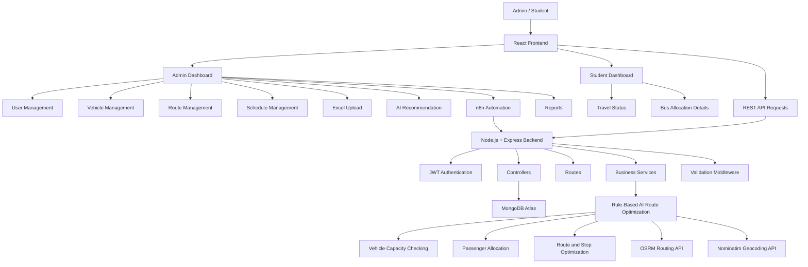

# AI-Based Transportation Management System Architecture

```mermaid
flowchart TD
    A[Admin / Student] --> B[React Frontend]

    B --> C[Admin Dashboard]
    B --> D[Student Dashboard]

    C --> E[User Management]
    C --> F[Vehicle Management]
    C --> G[Route Management]
    C --> H[Schedule Management]
    C --> I[Excel Upload]
    C --> J[AI Recommendation]
    C --> K[n8n Automation]
    C --> L[Reports]

    D --> M[Travel Status]
    D --> N[Bus Allocation Details]

    B --> O[REST API Requests]

    O --> P[Node.js + Express Backend]

    P --> Q[JWT Authentication]
    P --> R[Controllers]
    P --> S[Routes]
    P --> T[Business Services]
    P --> U[Validation Middleware]

    R --> V[MongoDB Atlas]

    T --> W[Rule-Based AI Route Optimization]
    W --> X[Vehicle Capacity Checking]
    W --> Y[Passenger Allocation]
    W --> Z[Route and Stop Optimization]

    W --> AA[OSRM Routing API]
    W --> AB[Nominatim Geocoding API]

    K --> P
```
