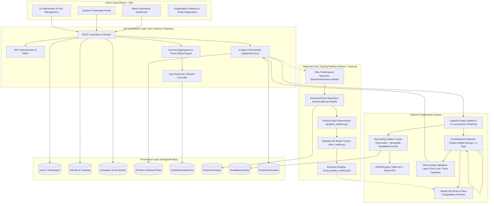

# AI-Based Transportation Management System — Hybrid Optimization Architecture

A production-grade, multi-tier transportation management and routing platform designed for institutions, universities, schools, and corporate campuses of arbitrary scale.

---

## 1. High-Level System Architecture



---

## 2. Core Architectural Principles

The architecture follows a strict hierarchy of authority:

```
+-------------------------------------------------------------+
|                      HUMAN AUTHORITY                        |
|   Admin Reviews, Approves, and Activates Transportation     |
+-------------------------------------------------------------+
                              |
+-------------------------------------------------------------+
|                 DETERMINISTIC SAFETY LAYER                  |
|   Zero passenger loss; strict vehicle capacity enforcement; |
|   passenger uniqueness; schedule availability checking.      |
+-------------------------------------------------------------+
                              |
+-------------------------------------------------------------+
|                    ROAD NETWORK VERIFIER                    |
|   OSRM Table API (real travel time/distance matrices) &     |
|   OSRM Route API (true road geometry and turn-by-turn).     |
+-------------------------------------------------------------+
                              |
+-------------------------------------------------------------+
|                  COMBINATORIAL SEARCH & DSA                 |
|   Clarke-Wright Savings; Min-Heap Priority Queue;           |
|   Capacity-Aware Greedy Clustering; 2-Opt Local Search.     |
+-------------------------------------------------------------+
                              |
+-------------------------------------------------------------+
|                     MACHINE LEARNING                        |
|   Tabular scoring advisor: Stop Compatibility, Route        |
|   Quality, Vehicle Suitability (never overrides road laws).  |
+-------------------------------------------------------------+
```

---

## 3. Detailed Component Lifecycles

### A. AI Plan vs Manual Plan Lifecycle
1. **Demand Snapshot**: Student travel status is aggregated (`Coming`, `Not Coming`, `Pending`). Only confirmed `Coming` passengers are routed.
2. **Recommendation Generation (Dry-Run)**: The engine clusters stops, queries OSRM (with MongoDB caching), calculates Clarke-Wright savings, scores candidates with ML, and applies 2-opt search. No database records are modified during preview.
3. **Admin Review & Approval**: The plan is saved as `DRAFT`, then transitioned to `APPROVED`.
4. **Plan Activation**: Upon activation, students are assigned their bus details, and a telemetry record is automatically written to `RoutePerformance` and `HistoricalRoute` to continuously expand training data.

### B. Late-Response Isolation Workflow
```mermaid
sequenceDiagram
    autonumber
    actor Student
    participant System as Travel Status Controller
    participant DB as MongoDB (LateResponseEvent)
    actor Admin
    participant Engine as AI Route Optimization Engine

    Student->>System: Updates status to "Coming" (AFTER plan approved/active)
    System->>DB: Log LateResponseEvent (status: PENDING)
    System-->>Student: Confirm received; status: UNALLOCATED / WAITING
    Note over Student,System: Student is NOT automatically inserted into active route
    Admin->>System: Inspects Unallocated / Late-Response Queue
    Admin->>Engine: Requests Route Regeneration or Manual Allocation
    Engine-->>Admin: Proposes Revised Plan with Capacity Checks
    Admin->>System: Approves & Activates Updated Plan
    System->>DB: Mark LateResponseEvent as RESOLVED
    System-->>Student: Bus Allocation Confirmed
```

---

## 4. Multi-Tier ML Fallback Hierarchy

To guarantee reliability across organizations of all sizes (from single school startups to multi-campus universities):

1. **Tier 1 (Trained ML Model)**: Used when `>= 10` validated historical routes exist. Scores candidate routes and stop co-occurrence affinities using weights learned from actual institutional trips.
2. **Tier 2 (Historical Co-occurrence Graph)**: When formal models are training, candidate stops are scored based on empirical Jaccard similarity and co-occurrence frequency in past schedules.
3. **Tier 3 (Pure Deterministic Optimization)**: When cold-starting with zero historical data, the engine gracefully falls back to classical Clarke-Wright savings, nearest insertion, spatial Euclidean/OSRM heuristics, and 2-opt refinement.

---

## 5. Algorithmic Specifications

| Component | Algorithm / Structure | Purpose |
| :--- | :--- | :--- |
| **Savings Queue** | Binary Min-Heap (`PriorityQueue`) | $O(\log K)$ extraction of top Clarke-Wright savings candidates |
| **Stop Clustering** | Capacity-Constrained Greedy Clustering | Prevents cluster overflow before routing commences |
| **Route Generation** | Clarke-Wright Savings with ML Blending | Merges radial trips based on road savings $\times$ ML affinity |
| **Stop Sequencing** | 2-Opt Local Search | Uncrosses paths and minimizes total road distance/time |
| **Matrix Caching** | Two-Tier Cache (In-Memory + MongoDB TTL) | Eliminates redundant OSRM network calls for recurring stops |
| **Telemetry Recording** | Automated Event Listener | Records planned vs. actual operational metrics upon plan activation |
