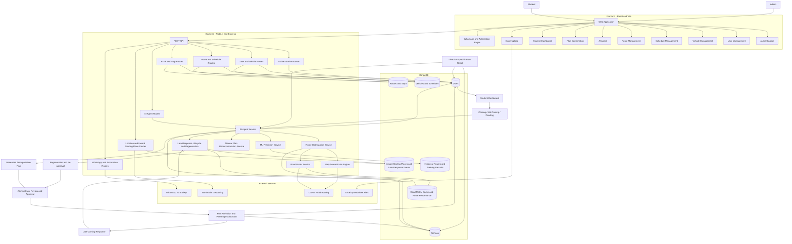

# AI-Based Transportation Management System

## System Overview

The AI-Based Transportation Management System manages student transportation through user and vehicle management, route optimization, schedule management, travel-status tracking, and administrator-controlled plan approval.

The system uses a React/Vite frontend, a Node.js/Express backend, MongoDB for persistent storage, and road-routing services for distance-aware route planning.

## System Architecture Diagram

## Main Components

### 1. Frontend

The React/Vite application provides separate interfaces for administrators and students. Administrators manage users, vehicles, schedules, routes, and transportation plans. Students submit travel-status responses and view their transportation allocation.

### 2. Backend and API

The Node.js/Express backend exposes REST APIs for authentication, user and vehicle management, routes, schedules, Excel imports, AI recommendations, location management, WhatsApp, and automation.

### 3. AI Route Optimization

The route optimization pipeline uses road-network information, passenger demand, vehicle capacity, stop locations, and fleet availability to generate transportation plans. Optimization techniques include capacity-aware routing, road-cost-based stop sequencing, route improvement, and 2-opt optimization.

### 4. Database

MongoDB stores user information, vehicles, schedules, routes, stops, AI plans, historical route information, road-matrix cache data, and late-response events.

### 5. External Services

- **OSRM:** Road-network distances, travel-time estimates, and route geometry.
- **Nominatim:** Geographic location search and geocoding.
- **WhatsApp:** Messaging integration through the Baileys library.
- **Excel:** Spreadsheet-based user-data import.

Availability and behavior depend on the current implementation and external service connectivity.

## Transportation Plan Lifecycle

1. Students submit their travel status.
2. The backend identifies confirmed passengers and available vehicles.
3. The route optimization engine generates a proposed plan.
4. The administrator reviews and approves the plan.
5. Plan activation saves passenger allocations.
6. Students view their allocations on the student dashboard.
7. A late Coming response after plan approval can trigger the late-response handling and regeneration workflow.
8. An administrator can reset a plan when required. Reset behavior is direction-specific.

## Machine Learning Status

The current route-planning implementation includes deterministic heuristic optimization and historical-data-based features. A trained machine-learning model should not be considered active unless model training and inference are verified in the implementation.

## Technology Stack

| Layer | Technology |
|---|---|
| Frontend | React, Vite, CSS |
| Backend | Node.js, Express |
| Database | MongoDB, Mongoose |
| Mapping and routing | OSRM, Nominatim, Leaflet where implemented |
| Spreadsheet import | XLSX |
| Messaging | Baileys WhatsApp integration |
| Optimization | Road-aware routing, capacity constraints, route-improvement algorithms |

---

