# AI-Based Transportation Management System — System Architecture Documentation

**Document Status:** Production Reference Architecture  
**Target Audience:** Final-Year B.E. Project Review Board, Technical Examiners, and System Maintainers  
**Author:** AI Transportation Project Team  
**Date:** October 2026  
**Active Production Mode:** `DETERMINISTIC_HEURISTIC_OPTIMIZER` (v2.2.0-heuristic)

---

## 1. Executive Summary & Architectural Overview

The **AI-Based Transportation Management System** is an end-to-end, multi-tier institutional mobility platform engineered for colleges, universities, schools, and corporate campuses. The system automates vehicle routing, student passenger demand tracking, vehicle fleet capacity allocation, road-aware stop sequencing, and late-arrival lifecycle management.

### Key Architectural Strengths:
1. **Mathematical Safety & Zero Passenger Loss:** Guarantees that every student who confirms travel is allocated a seat without exceeding physical vehicle capacities ($Cap_v$).
2. **Road-Network Aware Optimization:** Uses real-world road networks via the Open Source Routing Machine (OSRM) Table and Route APIs rather than naive straight-line (Euclidean) distances.
3. **Multi-Tier Combinatorial Optimization:** Implements the Clarke-Wright Savings algorithm backed by a binary Min-Heap Priority Queue ($O(\log K)$ extraction), capacity-constrained greedy clustering, road-cost nearest insertion, and 2-opt edge-exchange local search.
4. **Isolated Late-Response Isolation:** Late status updates received after plan approval/activation do not destabilize running routes; they are isolated into a `LateResponseEvent` quarantine queue for admin review and managed AI regeneration.
5. **Two-Tier Road Matrix Caching:** Leverages in-memory maps and persistent MongoDB TTL collections (`RoadMatrixCache`) to minimize redundant network roundtrips to external GIS servers.
6. **Direct Multi-Device WhatsApp Engine:** Natively embeds the Baileys WebSocket library (`@whiskeysockets/baileys`) for direct WhatsApp communication, supplemented by an optional n8n automation webhook for scheduled bulk travel status reminders.

---

## 2. Complete System Architecture Diagram

```mermaid
flowchart TD
    %% ========================================================================
    %% LAYER 1: USERS & ACTORS
    %% ========================================================================
    subgraph L1_Users ["1. Users & Stakeholders"]
        ACT_ADMIN["Administrator / Transport Coordinator<br/>• Fleet & Route Supervision<br/>• Plan Review & Activation<br/>• Late Queue Management"]
        ACT_STUDENT["Student / Daily Commuter<br/>• Daily Travel Status Submission<br/>• Assigned Bus & Stop View<br/>• Real-time Alerts"]
    end

    %% ========================================================================
    %% LAYER 2: FRONTEND PRESENTATION LAYER (REACT + VITE)
    %% ========================================================================
    subgraph L2_Frontend ["2. Frontend Presentation Layer (React 18 + Vite)"]
        direction TB
        subgraph FE_Auth ["Authentication & Portals"]
            UI_Landing["Landing & Role Router<br/>(Landing.jsx)"]
            UI_AdminLogin["Admin Login (JWT Auth)<br/>(AdminLogin.jsx)"]
            UI_StudentLogin["Student Login (ID/Phone)<br/>(StudentLogin.jsx)"]
        end

        subgraph FE_AdminOps ["Administrative Management Pages"]
            UI_AdminDash["Admin Dashboard<br/>KPI Metrics & Fleet Overview<br/>(AdminDashboard.jsx)"]
            UI_UserMgmt["User Management<br/>Students & Staff Profiles<br/>(UserManagement.jsx)"]
            UI_VehicleMgmt["Vehicle Management<br/>Bus Capacities & Status<br/>(VehicleManagement.jsx)"]
            UI_RouteMgmt["Route Management<br/>Interactive Stop Sequence & Map<br/>(RouteManagement.jsx)"]
            UI_SchedMgmt["Schedule Management<br/>Operating Shifts & Time Windows<br/>(ScheduleManagement.jsx)"]
            UI_DepotMgmt["Inward Starting Places<br/>Bus Depot Hub Config<br/>(InwardStartingPlaces.jsx)"]
            UI_ExcelUpload["Excel Ingestion Portal<br/>Bulk Student/Stop Importer<br/>(ExcelUpload.jsx / ImportExcel.jsx)"]
        end

        subgraph FE_AIOps ["AI Engine & Plan Operations"]
            UI_AIAgent["AI Agent Optimization Console<br/>Dry-Run, Diagnostics & Tuning<br/>(AIAgent.jsx)"]
            UI_PlanConfirm["Plan Confirmation & Activation<br/>Manifests & Direction Resets<br/>(PlanConfirmation.jsx)"]
            UI_ManualPlan["Admin Manual Plan Editor<br/>Curated Routing & AI Assist<br/>(AdminManualPlan.jsx)"]
            UI_Automation["Automation & WhatsApp Hub<br/>Status Dispatch & n8n Monitoring<br/>(Automation.jsx)"]
        end

        subgraph FE_StudentPortal ["Student Self-Service Portal"]
            UI_StudentDash["Student Dashboard<br/>Travel Status Toggle (Coming / Not)<br/>Assigned Bus, Stop & Driver Details<br/>(StudentDashboard.jsx)"]
        end
    end

    %% ========================================================================
    %% LAYER 3: BACKEND APPLICATION LAYER (NODE.JS + EXPRESS)
    %% ========================================================================
    subgraph L3_Backend ["3. Backend Application & API Layer (Node.js + Express 5)"]
        direction TB
        API_GW["Express 5 HTTP Router & CORS<br/>• Performance Timing Middleware<br/>• Cache-Control: no-store Header<br/>• Global JSON Error Boundary"]
        AUTH_MW["JWT Verification & RBAC Middleware<br/>Token Expiry & Role Enforcer"]

        subgraph BE_Controllers ["REST API Controllers & Endpoints"]
            CTRL_Auth["/api/auth<br/>Login, Token Verification & Session"]
            CTRL_Users["/api/users<br/>User CRUD & Travel Status Updates"]
            CTRL_Vehicles["/api/vehicles<br/>Fleet Inventory & Availability"]
            CTRL_Routes["/api/routes & /api/stops<br/>Stop Coordinates & Route Paths"]
            CTRL_Schedules["/api/schedules<br/>Shift Timetables & Trip Calendars"]
            CTRL_Excel["/api/excel<br/>Multer Multipart Parser & XLSX Import"]
            CTRL_Depots["/api/inward-starting-places<br/>Per-Bus Starting Depot Config"]
            CTRL_WhatsApp["/api/whatsapp & /api/automation<br/>Baileys Dispatch & Automation Trigger"]
        end

        subgraph BE_CoreServices ["Core Backend Orchestration Services"]
            SRV_AIAgent["AI Agent Service (aiAgentService.js)<br/>• Demand Aggregation & Optimization Pipeline<br/>• Directional Filtering (INWARD / OUTWARD)<br/>• Telemetry Recording & KPI Diagnostics"]
            SRV_PlanLife["Plan Activation Engine (activate_live_plan.js)<br/>• Atomic Passenger Seat Allocation<br/>• User Model assignedBus Updates<br/>• Historical Telemetry Logging"]
            SRV_LateLife["Late-Response Lifecycle Service (lateResponseLifecycleService.js)<br/>• Late Student Detection & Quarantine<br/>• LateResponseEvent Key Generation<br/>• Isolated Status: UNALLOCATED / WAITING"]
            SRV_LateRegen["Late-Response Regeneration Service (lateResponseRegenerationService.js)<br/>• Incremental Vehicle Capacity Probing<br/>• Dynamic Re-routing & Revised Proposals<br/>• Event Resolution upon Re-approval"]
            SRV_Auto["Travel Status Automation (travelStatusAutomationService.js)<br/>• Valid Phone Normalization (E.164)<br/>• Webhook Payload Construction<br/>• Batch Dispatch Dispatcher"]
        end
    end

    %% ========================================================================
    %% LAYER 4: AI COMBINATORIAL ROUTE OPTIMIZATION ENGINE
    %% ========================================================================
    subgraph L4_Optimization ["4. AI Combinatorial Route Optimization Engine"]
        direction TB
        OPT_Demand["1. Confirmed Passenger Identification<br/>• Filter: travelStatus === 'Coming'<br/>• Active Student Verification<br/>• Pickup Coordinate Extraction"]
        OPT_Fleet["2. Fleet Capacity & Vehicle Validation<br/>• Available Bus Query & Seat Capacities (Cap_v)<br/>• Campus Starting Hub Validation<br/>• Feasibility Bound Checks"]
        OPT_OSRM["3. Road Network Cost Evaluation<br/>• OSRM Table API Query (Driving Times & Distances)<br/>• Asymmetric Road Matrix Assembly<br/>• Two-Tier TTL Cache Lookup"]
        OPT_CW["4. Clarke-Wright Road Savings Algorithm<br/>• Min-Heap Priority Queue Extraction O(log K)<br/>• Road Savings: S_ij = C_0i + C_0j - C_ij<br/>• Capacity-Constrained Greedy Clustering"]
        OPT_Insertion["5. Road-Cost Nearest Insertion & Sequencing<br/>• Minimizes Detour Penalties Along Road Geometry<br/>• Directional Bearing Alignment from Hub"]
        OPT_2Opt["6. 2-Opt Local Search Improvement<br/>• Untangles Intersecting Road Segments<br/>• Relocate, Exchange & Or-opt Inter-Route Moves<br/>• Total Route Distance & Time Minimization"]
        OPT_Scoring["7. Multi-Objective Route Quality Scoring<br/>• Utilization Ratio (Optimal 85-100%)<br/>• Distance Efficiency & Stop Spacing<br/>• Historical Stop Co-occurrence (Jaccard Score)"]
        OPT_Deterministic["8. Deterministic Validation & Zero-Loss Layer<br/>• Zero Passenger Loss Enforcement<br/>• Strict Physical Seat Limits (No Overcrowding)<br/>• Delayed Fleet-Wide Vehicle Assignment"]

        OPT_Demand --> OPT_Fleet
        OPT_Fleet --> OPT_OSRM
        OPT_OSRM --> OPT_CW
        OPT_CW --> OPT_Insertion
        OPT_Insertion --> OPT_2Opt
        OPT_2Opt --> OPT_Scoring
        OPT_Scoring --> OPT_Deterministic
    end

    %% ========================================================================
    %% LAYER 5: PERSISTENCE & CACHE LAYER (MONGODB ATLAS)
    %% ========================================================================
    subgraph L5_Database ["5. Persistence & Cache Layer (MongoDB Atlas)"]
        DB_Users[("Users<br/>• Auth Credentials & Roles<br/>• travelStatus (Coming/Not)<br/>• assignedBus & Assigned Stop<br/>• E.164 Phone Numbers")]
        DB_Vehicles[("Vehicles<br/>• Bus Registration Number<br/>• Seating Capacity (Cap_v)<br/>• Availability & Driver Info")]
        DB_Routes[("Routes & Stops<br/>• Stop Names & Lat/Lon<br/>• Ordered Sequence<br/>• Turn-by-Turn Road Polylines")]
        DB_Schedules[("Schedules<br/>• Operating Shifts<br/>• Morning Pickup Windows<br/>• Evening Departure Windows")]
        DB_Plans[("AiPlans (ai_selected_plans)<br/>• Plan ID & Version<br/>• Direction: INWARD / OUTWARD<br/>• Status: draft / approved / active<br/>• Route Geometry & Manifests")]
        DB_LateEvents[("LateResponseEvents<br/>• Deduplicated Event Key<br/>• Student ID & Approval Event ID<br/>• Status: PENDING / RESOLVED")]
        DB_InwardDepots[("InwardStartingPlaces<br/>• Vehicle ID<br/>• Depot Name & Lat/Lon<br/>• Starting Geographic Anchor")]
        DB_MatrixCache[("RoadMatrixCache<br/>• OSRM Distance & Duration<br/>• Coordinate Hash Keys<br/>• Automatic TTL Expiration")]
        DB_GeoLocations[("mapLocations<br/>• Nominatim Geocoding Cache<br/>• Resolved Addresses & Lat/Lon")]
        DB_Telemetry[("RoutePerformance & HistoricalRoutes<br/>• Planned vs Actual Mileage<br/>• Stop Co-occurrence Matrices<br/>• Longitudinal KPI Logs")]
        DB_MLRecords[("MLTrainingRecords<br/>• Curated Route Snapshots<br/>• Tabular Training Data Store")]
    end

    %% ========================================================================
    %% LAYER 6: EXTERNAL SERVICES & INTEGRATIONS
    %% ========================================================================
    subgraph L6_External ["6. External Services & Communication Protocols"]
        direction TB
        EXT_OSRM["OSRM Routing Engine<br/>(Open Source Routing Machine)<br/>• Table API: Duration & Distance Matrix<br/>• Route API: Road Polylines & Turn Guidance"]
        EXT_Nominatim["OSM Nominatim Geocoder<br/>(OpenStreetMap)<br/>• Forward & Reverse Geocoding<br/>• Address Resolution to WGS-84 Coordinates"]
        EXT_Baileys["WhatsApp Multi-Device Engine<br/>(@whiskeysockets/baileys)<br/>• Embedded WebSocket Connection<br/>• QR Terminal Session Auth<br/>• Direct Passenger Travel Status Alerts"]
        EXT_Excel["Spreadsheet Import Service<br/>(xlsx / SheetJS)<br/>• Institution Student / Staff Master Rosters<br/>• Multi-column Mapping & Validation"]
        EXT_n8n["n8n Automation Engine (Optional Webhook)<br/>• Port 5678 Webhook Runner<br/>• Scheduled Notification Triggers<br/>• Calls back to /api/whatsapp/send"]
    end

    %% ========================================================================
    %% INTER-LAYER CONNECTORS & COMMUNICATION PATHS
    %% ========================================================================
    
    %% Users to Frontend
    ACT_ADMIN -->|HTTPS / Browser Web UI| UI_AdminLogin
    ACT_ADMIN -->|HTTPS / Browser Web UI| UI_AdminDash
    ACT_STUDENT -->|HTTPS / Mobile & Web UI| UI_StudentLogin
    ACT_STUDENT -->|HTTPS / Mobile & Web UI| UI_StudentDash

    %% Frontend to API Gateway
    UI_Landing --> API_GW
    UI_AdminLogin -->|POST /api/auth/login| API_GW
    UI_StudentLogin -->|POST /api/auth/student-login| API_GW
    UI_AdminDash -->|GET /api/admin/dashboard/metrics| API_GW
    UI_UserMgmt -->|REST CRUD /api/users| API_GW
    UI_VehicleMgmt -->|REST CRUD /api/vehicles| API_GW
    UI_RouteMgmt -->|REST CRUD /api/routes| API_GW
    UI_SchedMgmt -->|REST CRUD /api/schedules| API_GW
    UI_DepotMgmt -->|REST CRUD /api/inward-starting-places| API_GW
    UI_ExcelUpload -->|Multipart POST /api/excel/upload| API_GW
    UI_AIAgent -->|POST /api/ai-agent/generate-plan| API_GW
    UI_PlanConfirm -->|POST /api/ai-agent/approve-plan| API_GW
    UI_ManualPlan -->|POST /api/ai-agent/manual-plan| API_GW
    UI_Automation -->|POST /api/automation/send-travel-status| API_GW
    UI_StudentDash -->|PUT /api/users/travel-status| API_GW

    %% API Gateway through Middleware to Controllers
    API_GW --> AUTH_MW
    AUTH_MW --> CTRL_Auth
    AUTH_MW --> CTRL_Users
    AUTH_MW --> CTRL_Vehicles
    AUTH_MW --> CTRL_Routes
    AUTH_MW --> CTRL_Schedules
    AUTH_MW --> CTRL_Excel
    AUTH_MW --> CTRL_Depots
    AUTH_MW --> CTRL_WhatsApp

    %% Controllers to Backend Services
    CTRL_Users --> SRV_AIAgent
    CTRL_Users --> SRV_LateLife
    CTRL_WhatsApp --> SRV_Auto
    CTRL_WhatsApp --> EXT_Baileys
    API_GW -->|AI Plan Requests| SRV_AIAgent
    API_GW -->|Plan Activation| SRV_PlanLife
    API_GW -->|Late Response Management| SRV_LateLife
    API_GW -->|Plan Regeneration| SRV_LateRegen

    %% Backend Services to AI Optimization Engine
    SRV_AIAgent -->|1. Transmit Confirmed Passengers & Depots| OPT_Demand
    OPT_Deterministic -->|8. Return Feasible Validated Route Plan| SRV_AIAgent
    SRV_LateRegen -->|Inject Late Students into Feasibility Engine| OPT_Demand

    %% Optimization Engine to External Services & Caches
    OPT_OSRM <-->|Read / Write Road Matrices| DB_MatrixCache
    OPT_OSRM <-->|HTTP GET Table & Route API| EXT_OSRM
    CTRL_Routes <-->|HTTP Geocode Queries| EXT_Nominatim
    CTRL_Routes <-->|Read / Write Geocoded Points| DB_GeoLocations
    CTRL_Excel <-->|Spreadsheet Buffer Parsing| EXT_Excel
    SRV_Auto -->|POST HTTP Webhook| EXT_n8n
    EXT_n8n -.->|Webhook Callback POST /api/whatsapp/send| CTRL_WhatsApp
    CTRL_WhatsApp -->|Direct WhatsApp Socket Message| EXT_Baileys
    EXT_Baileys -->|WhatsApp Instant Message| ACT_STUDENT

    %% Backend Services & Controllers to MongoDB
    CTRL_Auth <--> DB_Users
    CTRL_Users <--> DB_Users
    CTRL_Vehicles <--> DB_Vehicles
    CTRL_Routes <--> DB_Routes
    CTRL_Schedules <--> DB_Schedules
    CTRL_Depots <--> DB_InwardDepots
    CTRL_Excel --> DB_Users
    SRV_AIAgent <--> DB_Plans
    SRV_PlanLife -->|Update assignedBus & allocation| DB_Users
    SRV_PlanLife -->|Save Approved/Active Plan| DB_Plans
    SRV_PlanLife -->|Record Operational Telemetry| DB_Telemetry
    SRV_LateLife <--> DB_LateEvents
    SRV_LateRegen <--> DB_LateEvents
    OPT_Scoring <-->|Read Stop Co-occurrences| DB_Telemetry
```



---

## 3. Detailed Component Breakdown by Architectural Layer

### Layer 1: Users & Stakeholders
* **Administrator / Transport Coordinator:** Holds institutional administrative authority. Responsible for uploading student rosters via Excel, configuring bus fleets and seating limits, specifying inward starting depots, triggering AI optimization dry-runs, reviewing route proposals, approving plans, executing live activations, monitoring the late-response queue, and initiating WhatsApp travel status reminder broadcasts.
* **Student / Commuter:** Daily passengers accessing the mobile/desktop web portal to update their commute intention (`Coming`, `Not Coming`, `Pending`). Once an approved plan is active, students view their allocated bus number, designated boarding stop, estimated pickup time, and turn-by-turn route map.

### Layer 2: Frontend Presentation Layer (React 18 + Vite)
Built with React 18, Vite, React Router v6, Axios (`api.js`), React Hot Toast, and Leaflet OpenStreetMap components:
1. **Authentication (`AdminLogin.jsx`, `StudentLogin.jsx`, `Landing.jsx`):** Secure login views utilizing JSON Web Tokens stored in HTTP-accessible client storage with role-based routing.
2. **Admin Dashboard (`AdminDashboard.jsx`):** Real-time administrative cockpit rendering vehicle utilization percentages, confirmed traveler counts, active route totals, and system health status.
3. **User Management (`UserManagement.jsx`):** Tabular management of students, faculty, and drivers, displaying travel status, phone numbers, assigned routes, and direct CRUD operations.
4. **Vehicle Management (`VehicleManagement.jsx`):** Fleet inventory manager capturing bus numbers, seating capacities ($Cap_v$), maintenance statuses, and assigned drivers.
5. **Route Management (`RouteManagement.jsx`):** Interactive map canvas rendering sequenced stops, road polylines, direction selectors (`INWARD` / `OUTWARD`), and manual waypoint reordering.
6. **Schedule Management (`ScheduleManagement.jsx`):** Timetable manager defining morning pickup departure times, evening return departures, and campus shift schedules.
7. **AI Agent Studio (`AIAgent.jsx`):** Control console for the optimization engine. Allows parameter adjustment, dry-run route generation, route-by-route metric inspection, explanation logs, and one-click direction-specific plan reset.
8. **Plan Confirmation (`PlanConfirmation.jsx`):** Side-by-side proposal verification interface. Displays passenger manifests per bus, unallocated passengers (if any), total kilometers, and the final "Approve & Activate" execution trigger.
9. **Admin Manual Plan (`AdminManualPlan.jsx`):** Allows administrative personnel to construct customized routes while receiving automated vehicle suitability and capacity warnings from `manualPlanRecommendationService.js`.
10. **Student Dashboard (`StudentDashboard.jsx`):** Mobile-first commuter portal allowing one-tap status toggling (`Coming` / `Not Coming`). Dynamically reflects bus allocation and informs late responders that their request is queued for administrator review.
11. **Excel Upload (`ExcelUpload.jsx` / `ImportExcel.jsx`):** Drag-and-drop spreadsheet ingestion interface supporting `.xlsx` and `.xls` files for instantaneous batch student/stop provisioning.
12. **Automation & WhatsApp Hub (`Automation.jsx`):** Operations center for triggering bulk travel-status reminder messages via n8n automation, featuring connection status pills and execution summaries.

### Layer 3: Backend Application & API Layer (Node.js + Express 5)
Engineered on Express 5 running on Node.js v22 with ES Modules:
* **API Gateway & Routing (`server.js`):** Unified Express server with CORS configuration, request body limits, diagnostic performance timing middleware, and cache prevention headers (`Cache-Control: no-store`).
* **Authentication & RBAC Middleware (`authRoutes.js`, `middleware/auth.js`):** Signs and verifies HMAC-SHA256 JWT tokens, protecting administrative endpoints.
* **REST Resource Controllers:** Dedicated controllers managing Users, Vehicles, Routes, Stops, Schedules, Starting Places, and Geocoding APIs.
* **Excel Import Engine (`excelRoutes.js`):** Employs Multer for memory buffering and `xlsx` (SheetJS) to parse, validate, and bulk-upsert hundreds of commuter records in under 2 seconds.
* **AI Agent Orchestrator (`aiAgentService.js`):** Coordinates data collection, isolates confirmed travelers, queries OSRM matrices, dispatches optimization jobs, and archives generated plan proposals.
* **Plan Activation Engine (`activate_live_plan.js`):** Performs atomic writes to update `User.assignedBus`, sets passenger boarding manifests, transitions `AiPlan` state from `approved` to `active`, and logs performance telemetry.
* **Late-Response Lifecycle Controller (`lateResponseLifecycleService.js`):** Intercepts late status updates from students after plan activation, computes deterministic deduplication keys (`lr_<studentId>_<direction>_<time>`), logs a quarantined `LateResponseEvent` (status: `PENDING`), and marks the student as `UNALLOCATED / WAITING`.
* **Late-Response Regeneration Engine (`lateResponseRegenerationService.js`):** Evaluates latecomers against existing route spare capacities, executes incremental insertion or localized Clarke-Wright re-routing, and produces a revised proposal for admin re-approval.
* **Travel Status Notification Service (`travelStatusAutomationService.js`):** Validates and normalizes phone numbers into E.164 format, skips numbers lacking WhatsApp credentials, formats personalized notifications, and dispatches requests to the n8n automation webhook.

### Layer 4: AI Combinatorial Route Optimization Engine
The optimization engine is structured into a pipeline of deterministic mathematical heuristics and DSA implementations:
1. **Confirmed Passenger Filtering:** Discards all commuters whose travel status is `Not Coming` or `Pending`. Only active passengers confirmed as `Coming` are submitted for routing.
2. **Fleet Capacity Validation:** Retrieves available buses from `Vehicle`, verifies total capacity $\sum Cap_v \ge N_{passengers}$, and retrieves inward starting hub coordinates from `InwardStartingPlace`.
3. **OSRM Road Network Distance & Travel-Time Matrix:** Queries the OSRM Table API using coordinates of all active stops and depots. Asymmetric driving distances and travel times are computed based on actual road networks and cached in MongoDB `RoadMatrixCache` with TTL.
4. **Clarke-Wright Road Savings Algorithm:** Computes asymmetric road savings for every stop pair $(i, j)$ relative to depot $0$:
   $$S_{ij} = C_{0, i} + C_{0, j} - C_{i, j}$$
   Savings pairs are managed using a custom binary Min-Heap `PriorityQueue` offering $O(\log K)$ push/pop performance.
5. **Road-Cost Nearest Insertion & Sequencing:** Merges radial trips into composite routes while adhering to strict capacity constraints ($Cap_v$) and directional bearing alignment from the depot.
6. **2-Opt Edge-Exchange Local Search:** For every candidate route, 2-opt evaluates all pairs of non-adjacent road segments, swapping edges whenever the swap decreases total road travel time or distance:
   $$\Delta = (C_{i, j} + C_{i+1, j+1}) - (C_{i, i+1} + C_{j, j+1}) < 0$$
   This eliminates hairpin turns, loops, and self-intersecting road segments.
7. **Multi-Objective Route Quality Scoring (`mlPredictionService.js`):** Evaluates candidate routes against four weighted dimensions:
   * Vehicle Utilization Ratio (Target: 85% to 100%)
   * Distance Efficiency per Stop ($\le 6.0\text{ km/stop}$)
   * Historical Route Pattern Similarity (Jaccard co-occurrence index)
   * Stop Density ($3 \le \text{stops} \le 9$)
8. **Deterministic Validation & Zero-Loss Layer:** Mathematical assertion layer guaranteeing:
   * Zero passenger loss: $\text{Allocated Passengers} = \text{Confirmed Coming Passengers}$.
   * Physical capacity bound: $\text{Passengers}(R_k) \le Cap_{Vehicle(k)}$.
   * Single assignment: Each passenger is assigned to exactly one vehicle.

### Layer 5: Persistence & Cache Layer (MongoDB Atlas)
Document models defined in Mongoose:
* `User`: Commuter accounts, roles (`admin`, `student`), `travelStatus` (`Coming`, `Not Coming`, `Pending`), `assignedBus`, stop location, and E.164 phone numbers.
* `Vehicle`: Fleet registration, seating capacity, active/maintenance flags.
* `Route` & `Stop`: Geometric waypoints, stop names, geographic coordinates, and ordered sequences.
* `Schedule`: Shift timetables, calendar dates, and operational departure windows.
* `AiPlan`: Authoritative collection (`ai_selected_plans`) storing plan versions, directional flags (`INWARD` / `OUTWARD`), routes, assigned vehicles, passenger manifests, and approval state (`draft`, `approved`, `active`).
* `LateResponseEvent`: Quarantined late student requests containing unique event keys, student IDs, timestamps, and status (`PENDING`, `RESOLVED`, `REJECTED`).
* `InwardStartingPlace`: Geographic starting depot and campus coordinates per vehicle.
* `RoadMatrixCache`: Cached OSRM distance and duration matrices indexed by coordinate hash keys with automatic TTL expiration.
* `mapLocation`: Geocoded location cache storing OpenStreetMap Nominatim responses.
* `RoutePerformance` & `HistoricalRoute`: Telemetry records capturing planned vs actual route distance, capacity utilization, and stop co-occurrence matrices.
* `MLTrainingRecord`: Exported route datasets and telemetry snapshots for offline ML model training.

### Layer 6: External Services & Distributed Integrations
* **Open Source Routing Machine (OSRM):** High-performance routing engine providing Table API (duration and distance matrices) and Route API (turn-by-turn road geometry polylines).
* **Nominatim (OpenStreetMap):** Reverse and forward geocoding service resolving freeform campus landmark names into WGS-84 latitude/longitude coordinates.
* **Baileys WhatsApp Socket (`@whiskeysockets/baileys`):** Embedded Node.js multi-device WebSocket library running directly within the backend process. Handles QR-code terminal authentication, reconnection backoff, and direct text message dispatch to students.
* **Spreadsheet Import Engine (`xlsx`):** In-memory parsing library handling Excel `.xlsx` and `.xls` workbooks for bulk student record creation.
* **n8n Automation Engine (Optional Webhook):** External workflow automation runner listening on port `5678` (`/webhook/transport/send-travel-status`). Dispatches batch notifications and invokes the backend's `/api/whatsapp/send` endpoint.

---

## 4. Operational Workflows & Sequence Diagrams

### Workflow A: End-to-End Plan Generation, Approval & Live Activation

```mermaid
sequenceDiagram
    autonumber
    actor Student as Student Commuters
    actor Admin as Administrator
    participant FE as React Frontend (AIAgent & PlanConfirmation)
    participant API as Express API Gateway
    participant AI as AI Agent Orchestration Service
    participant OPT as Combinatorial Optimization Engine
    participant OSRM as OSRM Table API & Cache
    participant DB as MongoDB (AiPlan & User)
    participant WA as Baileys WhatsApp Engine

    Note over Student,FE: Phase 1: Commuter Demand Snapshot
    Student->>API: PUT /api/users/travel-status ("Coming" / "Not Coming")
    API->>DB: Update User.travelStatus

    Note over Admin,OPT: Phase 2: AI Optimization (Dry-Run Preview)
    Admin->>FE: Select Direction (INWARD/OUTWARD) & Click "Generate AI Plan"
    FE->>API: POST /api/ai-agent/generate-plan
    API->>AI: executePlanGeneration({ direction })
    AI->>DB: Query confirmed Coming passengers & available vehicles
    AI->>OSRM: Request driving distance & duration matrix (with MongoDB Cache)
    OSRM-->>AI: Return Asymmetric Road Distance Matrix
    AI->>OPT: Run Clarke-Wright Savings + 2-Opt Heuristics
    OPT-->>AI: Return Feasible Optimized Routes & Stop Sequences
    AI->>DB: Save plan draft with status: "draft"
    AI-->>FE: Return Proposed Routes, Mileage, Metrics & Diagnostics (No live data changed)

    Note over Admin,DB: Phase 3: Review, Approval & Live Activation
    Admin->>FE: Inspect Proposed Bus Routes & Manifests in Plan Confirmation
    Admin->>FE: Click "Approve & Activate Plan"
    FE->>API: POST /api/ai-agent/approve-plan { planId }
    API->>AI: activatePlan(planId)
    AI->>DB: Transition AiPlan status: "draft" -> "approved" -> "active"
    AI->>DB: Bulk update User.assignedBus & passengerAllocation for all riders
    AI->>DB: Record telemetry in RoutePerformance & HistoricalRoute
    API-->>FE: Plan Activation Confirmed (HTTP 200)

    Note over WA,Student: Phase 4: Commuter Notification & Live Display
    Admin->>FE: Click "Send Travel Status / WhatsApp Alerts"
    FE->>API: POST /api/automation/send-travel-status
    API->>WA: sendWhatsAppMessage(phone, assignedBusDetails)
    WA-->>Student: Direct WhatsApp Notification with Bus & Stop Details
    Student->>FE: Open Student Dashboard -> View Assigned Bus, Stop & Driver Details
```

---

### Workflow B: Late-Response Quarantine, Isolation & Regeneration Workflow

```mermaid
sequenceDiagram
    autonumber
    actor Student as Late Student Commuter
    participant API as Travel Status Controller
    participant LateSrv as Late-Response Lifecycle Service
    participant DB as MongoDB (LateResponseEvent & User)
    actor Admin as Administrator
    participant RegenSrv as Late-Response Regeneration Service
    participant OPT as Route Optimization Engine

    Note over Student,DB: Phase 1: Late Commute Submission Post-Activation
    Student->>API: PUT /api/users/travel-status ("Coming") AFTER plan is ACTIVE
    API->>LateSrv: handleStudentStatusChange(studentId, "Coming")
    LateSrv->>DB: Check if an active approved plan exists for current direction
    Note over LateSrv,DB: Active plan detected! Student cannot be inserted into running route.
    LateSrv->>DB: Create LateResponseEvent (status: "PENDING", eventKey: "lr_<id>_<dir>_<t>")
    LateSrv->>DB: Update User: assignedBus = null, allocationStatus = "UNALLOCATED / WAITING"
    API-->>Student: Status Saved: "Plan Already Active. You are placed in the Late Review Queue."

    Note over Admin,OPT: Phase 2: Administrative Review & AI Regeneration
    Admin->>API: GET /api/ai-agent/late-response-queue
    API->>DB: Query LateResponseEvents where status == "PENDING"
    API-->>Admin: Display Late Students List with Stop Names & Lat/Lon
    Admin->>API: POST /api/ai-agent/regenerate-late-plan { direction }
    API->>RegenSrv: regeneratePlanWithLateResponses(direction)
    RegenSrv->>DB: Fetch active plan, spare vehicle capacities, and pending late students
    RegenSrv->>OPT: Re-evaluate Routes (Incremental Insertion or Local Clarke-Wright)
    OPT-->>RegenSrv: Generate Revised Plan Proposal (All Late Students Accommodated)
    RegenSrv-->>Admin: Present Revised Plan Preview for Administrative Verification

    Note over Admin,DB: Phase 3: Administrative Re-Approval & Resolution
    Admin->>API: POST /api/ai-agent/approve-plan { planId: revisedPlanId }
    API->>RegenSrv: finalizePlanApproval(revisedPlanId)
    RegenSrv->>DB: Update AiPlan to new version (status: "active")
    RegenSrv->>DB: Bulk assign newly accommodated students to updated buses
    RegenSrv->>DB: Mark LateResponseEvents as "RESOLVED"
    API-->>Student: Student Dashboard updates: Assigned Bus & Boarding Stop Confirmed
```

---

## 5. Algorithmic Specifications & Mathematical Models

### 1. Clarke-Wright Road Savings Formulation
For institutional depot $0$ and student pickup stops $i$ and $j$, the road savings $S_{ij}$ represents the reduction in total road distance achieved by serving stops $i$ and $j$ on a single linked route rather than two independent return trips:
$$S_{ij} = D(0, i) + D(0, j) - D(i, j)$$
Where:
* $D(a, b)$ is the road network travel distance retrieved from the OSRM Table API.
* Savings pairs $(i, j)$ are sorted in descending order using a binary Min-Heap Priority Queue ($O(\log K)$ push/pop).
* Merging condition: Stops $i$ and $j$ are merged if and only if:
  $$\sum_{k \in R(i) \cup R(j)} q_k \le Cap_v$$
  Where $q_k$ is the passenger count at stop $k$, and $Cap_v$ is the seating capacity of the assigned vehicle.

### 2. 2-Opt Edge-Exchange Local Search
To eliminate route self-intersections and zig-zags caused by road network constraints:
1. For an ordered route with stops $(s_0, s_1, \dots, s_n, s_{n+1})$ where $s_0$ is the start depot and $s_{n+1}$ is the campus destination:
2. For all pairs $(i, j)$ such that $1 \le i < j \le n$:
3. Compute change in road travel cost:
   $$\Delta = \left[ D(s_i, s_j) + D(s_{i+1}, s_{j+1}) \right] - \left[ D(s_i, s_{i+1}) + D(s_j, s_{j+1}) \right]$$
4. If $\Delta < 0$, reverse the subsequence between $i+1$ and $j$:
   $$(s_0, \dots, s_i, \mathbf{s_j, s_{j-1}, \dots, s_{i+1}}, s_{j+1}, \dots, s_{n+1})$$
5. Repeat until no further improving 2-opt move exists (local optimum reached).

### 3. Historical Stop Co-occurrence (Jaccard Similarity)
To incorporate institutional travel patterns without overfitting to transient daily fluctuations:
$$J(A, B) = \frac{|\text{Routes containing both } A \text{ and } B|}{|\text{Routes containing } A| + |\text{Routes containing } B| - |\text{Routes containing both } A \text{ and } B|}$$
This co-occurrence score is weighted into the multi-factor stop compatibility metric ($0.40 \times \text{Co-occurrence} + 0.35 \times \text{Road Proximity} + 0.25 \times \text{Directional Alignment}$).

---

## 6. Technical Realities & Runtime Status Disclosures

In accordance with academic integrity and rigorous engineering standards, the following implementation realities are verified in the codebase:

1. **Active Optimization Runtime Mode (`DETERMINISTIC_HEURISTIC_OPTIMIZER`):**
   * As declared in `backend/services/mlPredictionService.js` (`ML_SYSTEM_STATUS`), the active production runtime operates in `DETERMINISTIC_HEURISTIC_OPTIMIZER` mode (v2.2.0-heuristic).
   * It relies on calibrated multi-objective feature weighting, Clarke-Wright savings, 2-opt local search, and Jaccard co-occurrence graphs.
   * A Python training pipeline exists in the `ml/` repository (`train_model.py`, producing `route_quality_model.json`), but the active production Node.js routing server executes deterministic heuristics to guarantee mathematical safety and zero passenger loss.
2. **WhatsApp Messaging Architecture:**
   * Direct WhatsApp messaging is implemented via the embedded `@whiskeysockets/baileys` library (`backend/whatsapp/whatsappService.js`), connecting directly to WhatsApp Multi-Device servers via WebSockets.
   * The n8n workflow definition (`n8n-workflow-travel-status.json`) and webhook (`http://localhost:5678/webhook/transport/send-travel-status`) are configured for scheduled reminder automation. If n8n is offline, administrative status alerts can still be sent directly via Baileys.
3. **Road Routing Engine:**
   * All distance and duration calculations use OSRM HTTP APIs, with aggressive two-tier caching (in-memory hash maps + MongoDB `RoadMatrixCache` with TTL indexes) to prevent rate limiting and eliminate latency.
